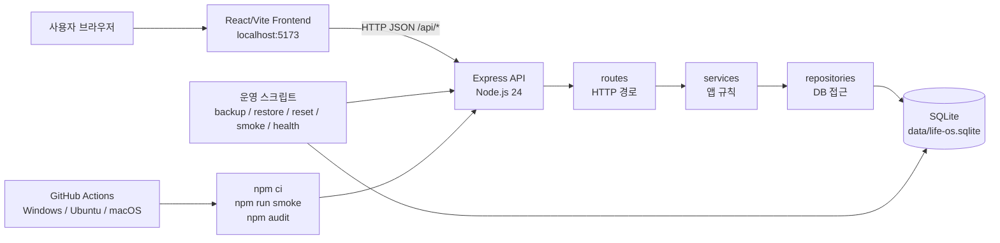
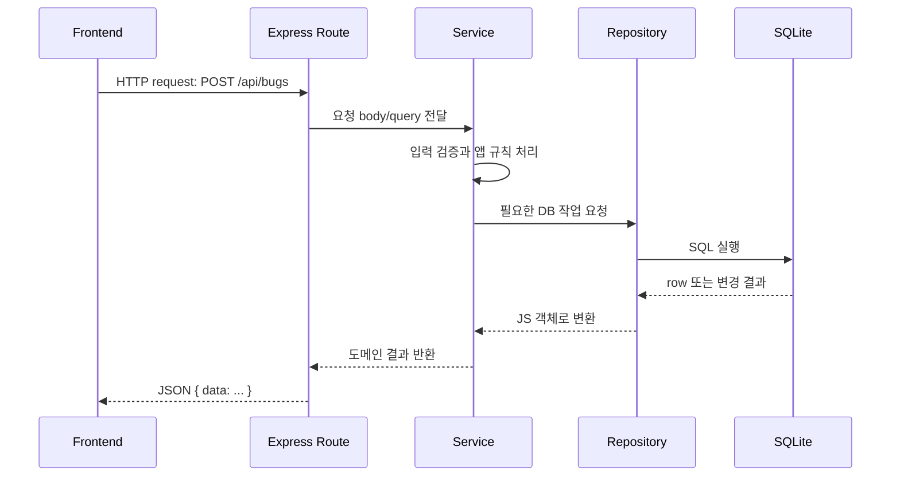
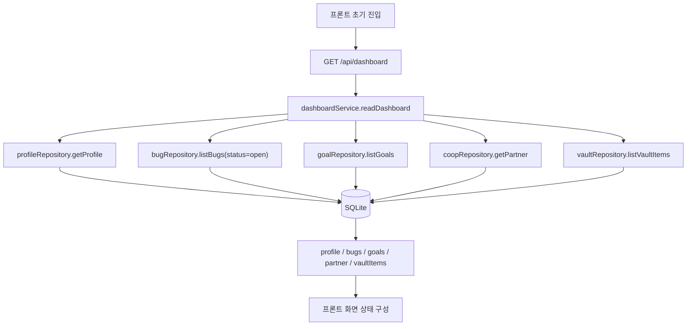
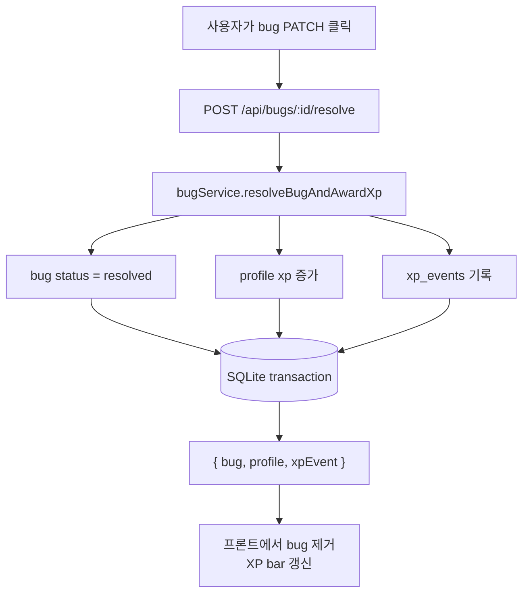

# 백엔드 구조 설계

## 설계 목표

백엔드는 로컬 실행을 우선한다. 구현은 작게 시작하되, 나중에 실제 인증, AI 연동, 암호화를 붙일 수 있도록 도메인별 경계를 나눈다.

## 권장 기술 스택

현재 프론트가 Node.js 기반 도구인 Vite를 사용하므로, 1차 백엔드는 Node.js 런타임 위에서 구현하는 편이 작업 비용이 낮다. 현재 구현 기준은 다음과 같다.

| 구분 | 현재 선택 | 역할 |
| --- | --- | --- |
| 런타임 | Node.js 24 | 백엔드 서버와 운영 스크립트 실행 |
| HTTP 서버 | Express | `/api/*` JSON REST API 제공 |
| DB 드라이버 | `better-sqlite3` | Node.js에서 SQLite 파일을 직접 읽고 쓰는 native addon |
| 저장소 | SQLite | 단일 로컬 사용자 데이터를 `data/life-os.sqlite`에 저장 |
| API 형식 | JSON REST API | 프론트 React/Vite 앱과 HTTP로 통신 |
| 검증 | `npm run smoke`, `npm run health` | 주요 API 흐름과 실행 상태 확인 |
| 운영 스크립트 | `backup`, `restore`, `reset` | 로컬 DB 백업, 복원, 초기화 |
| CI | GitHub Actions | Windows, Ubuntu, macOS에서 smoke와 audit 실행 |

이 선택은 로컬 단일 사용자 앱을 빠르게 실사용 가능한 형태로 만들기 위한 1차 결정이다. 인증, 실제 AI 연동, 실제 Vault 암호화, 데스크톱 패키징은 현재 필수 범위가 아니다.

## 전체 구성도



## 요청 처리 흐름



## 주요 데이터 흐름





## 디렉터리 구조 초안

```text
backend/
  package.json
  README.md
  data/
    life-os.sqlite
  docs/
    01-product-scope.md
    02-backend-architecture.md
    03-api-contract.md
    04-implementation-plan.md
  src/
    app.js
    server.js
    config/
      env.js
    db/
      connection.js
      schema.sql
      seed.js
    routes/
      health.js
      dashboard.js
      bugs.js
      goals.js
      xp.js
      ai.js
      vault.js
      coop.js
    services/
      dashboardService.js
      bugService.js
      goalService.js
      xpService.js
      aiService.js
      vaultService.js
      coopService.js
    repositories/
      bugRepository.js
      goalRepository.js
      profileRepository.js
      vaultRepository.js
      coopRepository.js
    middleware/
      errorHandler.js
      notFound.js
```

## 계층 책임

| 계층 | 책임 |
| --- | --- |
| `routes` | HTTP 메서드와 URL을 서비스 함수에 연결한다. 요청 파라미터를 읽고 응답 상태 코드를 정한다. |
| `services` | XP 증가, 버그 해결, Co-op 동기화 같은 앱 규칙을 처리한다. |
| `repositories` | SQLite 쿼리를 감싼다. 서비스는 SQL 세부 사항을 직접 알지 않는다. |
| `db` | 연결, 스키마, 초기 seed 데이터를 관리한다. |
| `middleware` | 공통 오류 응답과 없는 경로 처리를 담당한다. |

## 데이터 모델 초안

### `profiles`

단일 로컬 사용자를 저장한다.

| 필드 | 타입 | 설명 |
| --- | --- | --- |
| `id` | text | 로컬 사용자 ID |
| `display_name` | text | 표시 이름 |
| `avatar` | text | 이니셜 또는 아이콘 |
| `tier` | text | 티어 표시 |
| `level` | integer | 레벨 |
| `xp` | integer | 현재 XP |
| `xp_target` | integer | 다음 목표 XP |
| `created_at` | text | 생성 시각 |
| `updated_at` | text | 수정 시각 |

### `bugs`

생활 버그 목록을 저장한다.

| 필드 | 타입 | 설명 |
| --- | --- | --- |
| `id` | text | 버그 ID |
| `text` | text | 버그 내용 |
| `severity` | text | `critical`, `high`, `med`, `low` |
| `status` | text | `open`, `resolved` |
| `created_at` | text | 생성 시각 |
| `resolved_at` | text | 해결 시각 |

### `goals`

사용자와 파트너 목표를 저장한다.

| 필드 | 타입 | 설명 |
| --- | --- | --- |
| `id` | text | 목표 ID |
| `owner_type` | text | `self`, `partner` |
| `label` | text | 목표 이름 |
| `progress` | integer | 0부터 100까지의 진행률 |
| `created_at` | text | 생성 시각 |
| `updated_at` | text | 수정 시각 |

### `xp_events`

XP 변경 기록을 저장한다.

| 필드 | 타입 | 설명 |
| --- | --- | --- |
| `id` | text | 이벤트 ID |
| `delta` | integer | XP 변화량 |
| `reason` | text | 변경 이유 |
| `source_type` | text | `bug`, `goal`, `manual` |
| `source_id` | text | 원인이 된 항목 ID |
| `created_at` | text | 생성 시각 |

### `ai_advice`

AI 조언 주제와 응답 텍스트를 저장한다. 1차 구현에서는 외부 AI API 대신 정적 템플릿을 반환한다.

| 필드 | 타입 | 설명 |
| --- | --- | --- |
| `topic` | text | 조언 주제 |
| `body` | text | 응답 본문 |
| `is_static` | integer | 정적 응답 여부 |
| `updated_at` | text | 수정 시각 |

### `vault_items`

Vault 화면의 항목과 진행률을 저장한다.

| 필드 | 타입 | 설명 |
| --- | --- | --- |
| `id` | text | 항목 ID |
| `label` | text | 항목 이름 |
| `progress` | integer | 0부터 100까지의 진행률 |
| `icon` | text | 표시 아이콘 |
| `category` | text | 항목 분류 |
| `created_at` | text | 생성 시각 |
| `updated_at` | text | 수정 시각 |

### `coop_profiles`

Co-op 화면의 파트너 표시 정보를 저장한다.

| 필드 | 타입 | 설명 |
| --- | --- | --- |
| `id` | text | 파트너 ID |
| `display_name` | text | 표시 이름 |
| `avatar` | text | 이니셜 |
| `tier` | text | 티어 |
| `anniversary` | text | 기준일 |
| `updated_at` | text | 수정 시각 |

## 로컬 모드 정책

1차 백엔드는 단일 사용자 로컬 모드로 동작한다. 로그인 없이 기본 프로필 하나를 seed하고, 모든 API는 해당 프로필 기준으로 응답한다.

나중에 원격 배포를 고려하면 `profiles`를 사용자 계정과 연결하고, 각 테이블에 `profile_id` 또는 `user_id`를 추가한다.

## 보안 경계

현재 프론트의 Vault는 실제 보안 기능이 아니다. 1차 백엔드도 실제 암호화를 구현하지 않는다면 API와 문서에서 `mockUnlock` 또는 `localDemo` 상태를 명확히 표시해야 한다.

실제 암호화를 구현할 경우 별도 설계가 필요하다.

- 비밀번호 또는 passphrase 입력
- 키 파생 함수 선택
- 암호화 대상 필드 결정
- 복구 불가능성 안내
- 로그와 응답에 민감 정보 미포함

## 프론트 연동 방식

프론트에는 API 클라이언트 계층을 새로 두는 편이 좋다.

```text
frontend/src/api/
  client.js
  bugs.js
  dashboard.js
  ai.js
  vault.js
  coop.js
```

API 기준 URL은 `VITE_API_BASE_URL`로 관리한다. 로컬 기본값은 `http://localhost:4000`을 권장한다.

## 오류 응답 형식

모든 오류는 같은 JSON 형태를 사용한다.

```json
{
  "error": {
    "code": "VALIDATION_ERROR",
    "message": "severity must be one of critical, high, med, low",
    "details": {}
  }
}
```

## 검증 방법

- `GET /api/health`가 `ok`를 반환한다.
- seed 후 `GET /api/dashboard`가 현재 프론트 mock 화면과 같은 기본 데이터를 반환한다.
- 버그를 생성한 뒤 목록 조회에서 새 항목이 보인다.
- 버그를 해결하면 XP가 증가하고 `xp_events`에 기록된다.
- 서버를 재시작해도 SQLite 데이터가 유지된다.
